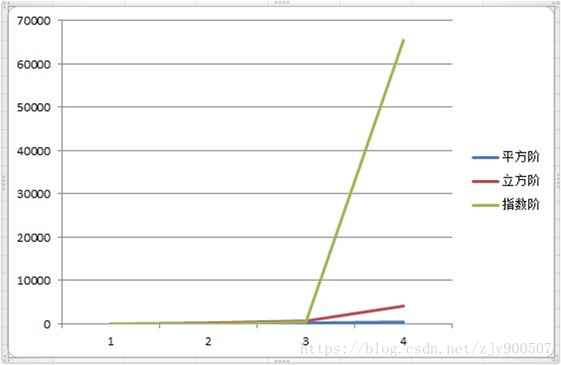

<br>

## 前言

本人平时学习及收集内容，欢迎参入一起讨论。

## 关于作者

一个工作八年的草根程序员。

## 内容

- [什么是复杂度分析 ？](#一什么是复杂度分析)
- [为什么要进行复杂度分析 ？](#二为什么要进行复杂度分析)
- [如何进行复杂度分析 ？](#三如何进行复杂度分析)
- [如何掌握好复杂度分析方法 ？](#四如何掌握好复杂度分析方法)

>复杂度分析是整个算法学习的精髓，只要掌握了它，数据结构和算法的内容基本上就掌握了一半了。

### 一、什么是复杂度分析 ？

1. 数据结构和算法解决是“如何让计算机更快时间、更省空间的解决问题”。
2. 因此需从执行时间和占用空间两个来评估数据结构和算法的性能。
3. 分别用时间复杂度和空间复杂度两个概念来描述性能问题，二者统称为复杂度。
4. 复杂度描述的是算法执行时间（或占用空间）与数据规模的增长关系。

### 二、为什么要进行复杂度分析 ？

1. 和性能测试相比，复杂度分析有不依赖执行环境、成本低、效率高、易操作、指导性强的特点。
2. 掌握复杂度分析，将能编写出性能更优的代码，有利于降低系统开发和维护成本。

### 三、如何进行复杂度分析 ？

- 大O表示法
- 时间复杂度
- 时间复杂度分析
- 常用的时间复杂度分析
- 时间复杂度分类
- 时间复杂度总结
- 空间复杂度分析

#### 3.1 大O表示法

算法的执行时间与代码的执行次数成正比，用T(n) = O(f(n)) 表示，其中T(n) 表示算法执行总时间，f(n) 表示每行代码执行总次数，而n往往表示数据的规模。这就是大O时间复杂度表示法。

#### 3.2 时间复杂度

**定义：**算法的时间复杂度，也就是算法的时间量度。

**大 O 时间复杂度表示法**实际上并不具体表示代码真正的执行时间，而是表示**代码执行时间随数据规模增长的变化趋势**，所以也叫渐进时间复杂度，简称**时间复杂度**。

例子1：

```
function aFun() {
    console.log("Hello, World!");      //  需要执行 1 次
    return 0;       // 需要执行 1 次
}

```
那么这个方法需要执行 2 次运算。

例子 2：

```
function bFun(n) {
    for(let i = 0; i < n; i++) {         // 需要执行 (n + 1) 次
        console.log("Hello, World!");      // 需要执行 n 次
    }
    return 0;       // 需要执行 1 次
}

```

那么这个方法需要执行 ( n + 1 + n + 1 ) = 2n +2 次运算。

例子 3：

```
function cal(n){
    let sum=0;  // 1次
    let i=1;    // 1次
    let j=1;    // 1次
    for(;i<=n;++i){
        j=1;    // n次
        for(;j<=n;++j){     // n*n，也即是  n平方次
            sum=sum+i*j;    // n*n，也即是 n平方次
        }
    }
}

```

注意，这里是二层for循环，所以第二层执行的是n * n = n2 次，而且这里的循环是++i，和例子2的是i++，是不同的，是先加与后加的区别。

那么这个方法需要执行( n2 + n2 + n + n + 1 + 1 +1 ) = 2n2 +2n + 3 。

**特点：**以时间复杂度为例，由于**时间复杂度**描述的是算法执行时间与数据规模的**增长变化趋势**，所以**常量**、**低阶**、**系数**实际上对这种增长趋势不产生决定性影响，所以在做时间复杂度分析时**忽略**这些项。

所以，上面例子1 的时间复杂度为 T(n) = O(1)，例子2 的时间复杂度为 T(n) = O(n)，例子3 的时间复杂度为 T(n) = O(n2)。

#### 3.3 时间复杂度分析

- **只关注循环执行次数最多的一段代码**

单段代码看高频：比如循环。

```
function cal(n){
    let sum=0;
    let i=1;
    for(;i<=n;++i){
        sum=sum+i;
    }
    return sum;
}

```

执行次数最多的是for循环及里面的代码，执行了n次，所以时间复杂度为O(n)。

- **加法法则：总复杂度等于量级最大的那段代码的复杂度**

多段代码取最大：比如一段代码中有单循环和多重循环，那么取多重循环的复杂度。

```

function cal(n){
    let sum_1=0;
    let p=1;
    for(;p<100;++p){
        sum_1=sum_1+p;
    }

    let sum_2=0;
    let q=1;
    for(;q<n;++q){
        sum_2=sum2+q;
    }

    let sum_3=0;
    let i=1;
    let j=1;
    for(;i<=n;++i){
        j=1;
        for(;j<=n;++j){
            sum_3=sum_3+i*j;
        }
    }
    return sum_1+sum_2+sum_3;
}

```

上面代码分为三部分，分别求sum_1、sum_2、sum_3，主要看循环部分。

第一部分，求sum_1，明确知道执行了100次，而和n规模无关，是个常量的执行时间，不能反映**增长变化趋势**，所以时间复杂度为O(1)。

第二和第三部分，求sum_2和sum_3，时间复杂度是和n的规模有关的，分别为O(n)和O(n2)。

所以，取三段代码的最大量级，上面例子的最终的时间复杂度O(n2)。

同理类推，如果有3层for循环，那么时间复杂度为O(n3)，4层就是O(n4)。

所以，**总的时间复杂度就等于量级最大的那段代码的时间复杂度。**

- **乘法法则：嵌套代码的复杂度等于嵌套内外代码复杂度的乘积**

嵌套代码求乘积：比如递归、多循环等。

```
function cal(n){
    let ret=0;
    let i=1;
    for(;i<n;++i){
        ret=ret+f(i);   //重点为 f(i)
    }
}

function f(n){
    let sum=0;
    let i=1;
    for(;i<n;++i){
        sum=sum+i;
    }
    return sum;
}

```

方法cal手环里面调用f方法，而f方法里面也有循环。

所以，整个 cal() 函数的时间复杂度就是，T(n) = T1(n) * T2(n) = O(n*n) = O(n2) 。

- **多个规模求加法：比如方法有两个参数控制两个循环的次数，那么这时就取二者复杂度相加**

```
function cal(m,n){
    let sum_1=0;
    let i=1;
    for(;i<m;++i){
        sum_1=sum_1+i;
    }

    let sum_2=0;
    let j=1;
    for(;j<n;++j){
        sum_2=sum_2+j;
    }

    return sum_1+sum_2;
}

```

以上代码也是求和，求sum_1的数据规模为m、求sum_2的数据规模为n，所以时间复杂度为O(m+n)。

**公式：**T1(m) + T2(n) = O(f(m) + g(n)) 。

- **多个规模求乘法：比如方法有两个参数控制两个循环的次数，那么这时就取二者复杂度相乘**

```

function cal(m,n){
    let sum_3=0;
    let i=1;
    let j=1;
    for(;i<=m;++i){
        j=1;
        for(;j<=m;++i){
            sum_3=sum_3+i*j;
        }
    }
}

```

以上代码也是求和，两层 for 循环 ，求 sum_3 的数据规模为 m 和 n，所以时间复杂度为 O(m*n)。

**公式：**T1(m) * T2(n) = O(f(m) * g(n)) 。

#### 3.4 常用的时间复杂度分析

- 多项式阶：随着数据规模的增长，算法的执行时间和空间占用，按照多项式的比例增长。

包括 O(1)（常数阶）、O(logn)（对数阶）、O(n)（线性阶）、O(nlogn)（线性对数阶）、O(n2) （平方阶）、O(n3)（立方阶）。

除了 O(logn)、O(nlogn) ，其他的都可从上面的几个例子中看到。

下面举例说明 O(logn)（对数阶）：

```
let i=1;
while (i <= n)  {
   i = i * 2;
}

```
代码是从1开始，每次循环就乘以2，当大于n时，循环结束。

其实就是高中学过的等比数列，i 的取值就是一个等比数列。在数学里面是这样子的：

20 21 22 ... 2k ... 2x = n

所以，我们只要知道 x 值是多少，就知道这行代码执行的次数了，通过 2x = n 求解 x，数学中求解得 x = log2n 。所以上面代码的时间复杂度为 O(log2n)。

实际上，不管是以 2 为底、以 3 为底，还是以 10 为底，我们可以把所有对数阶的时间复杂度都记为 O(logn)。为什么呢？

因为对数之间是可以互相转换的，log3n = log32 * log2n，所以 O(log3n) = O(C * log2n)，其中 C=log32 是一个常量。

由于**时间复杂度**描述的是算法执行时间与数据规模的**增长变化趋势**，所以**常量**、**低阶**、**系数**实际上对这种增长趋势不产生决定性影响，所以在做时间复杂度分析时**忽略**这些项。

因此，**在对数阶时间复杂度的表示方法里，我们忽略对数的 “底”，统一表示为 O(logn)**。

下面举例说明 O(nlogn)**（对数阶）**：

```
function aFun(n){
  let i = 1;
  while (i <= n)  {
     i = i * 2;
  }
  return i
}

function cal(n) { 
   let sum = 0;
   for (let i = 1; i <= n; ++i) {
     sum = sum + aFun(n);
   }
   return sum;
 }

```

- **非多项式阶：随着数据规模的增长，算法的执行时间和空间占用暴增，这类算法性能极差。**

包括 O(2n)（指数阶）、O(n!)（阶乘阶）。

O(2n)（指数阶）例子：

```

aFunc(n){
    if(n<=1){
        return 1;
    }else{
        return aFunc(n-1)+aFunc(n-2);
    }
}

```


#### 3.5 时间复杂度分类

#### 3.6 时间复杂度总结

常用的时间复杂度所耗费的时间从小到大依次是：

O(1) < O(logn) < (n) < O(nlogn) < O(n2) < O(n3) < O(2n) < O(n!) < O(nn)

常见的时间复杂度：




#### 3.7 空间复杂度分析


### 四、如何掌握好复杂度分析方法 ？

> 复杂度分析关键在于多练，所谓孰能生巧。

平时我们在写代码时，是用 空间换时间 还是 时间换空间，可以根据算法的时间复杂度和空间复杂度来衡量。

## 参考资料

- [JavaScript 数据结构与算法之美 - 时间和空间复杂度](https://github.com/biaochenxuying/blog/issues/29)
- [如何理解算法时间复杂度的表示法，例如 O(n²)、O(n)、O(1)、O(nlogn) 等？](https://www.zhihu.com/question/21387264)

## 联系作者

<div align="center">
    <p>
        在颠覆世界的同时，也要好好关照自己。
    </p>
    
</div>