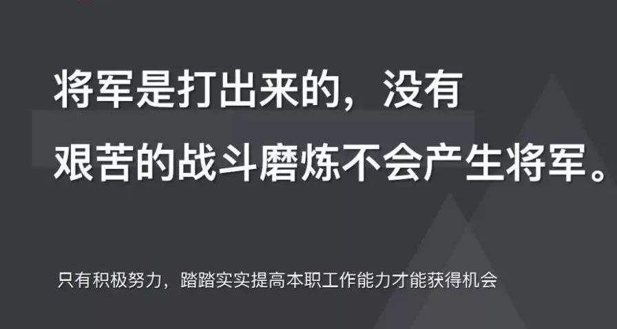

<br>

## 前言

本人平时学习及收集内容，欢迎参入一起讨论。

## 关于作者

一个工作八年的草根程序员。

## 内容

- 链表概念
- 单向链表
- 双向链表
- 反向链表

### 链表概念

```

```

### 单向链表

```

```

### 双向链表

```

```

### 反向链表

```

/**
*   节点定义
*/
class Node{
    constructor(value,next){
        this.value = value;
        this.next = next;
    }
}

/**
*   翻转链表
* @param {Node} head 未翻转链表的头节点
* @return {Node} 翻转链表后的头节点
*/
function reverseList(head){
    let node = head,
        pre = null;

    while (node){
        let next = node.next;

        node.next = pre;

        pre = node;
        node = next;
    }

    return pre;
}


```

## 联系作者

<div align="center">
    <p>
        平凡世界，贵在坚持。
    </p>
    
</div>
